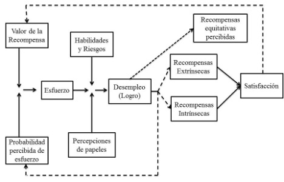

# Motivación

## Satisfacción Laboral
Comprender el comportamiento humano en las organizaciones, requiere revisar las contribuciones de la psicología al comportamiento organizacional; en esto, se hace mucha referencia a las actitudes y a la satisfacción laboral (Robbins, 1998). 
Es por eso que para hablar sobre la satisfacción laboral, primero hay que mencionar las actitudes. Las cuales son un factor muy importante, ya que representan un gran componente de los empleados para la organización (Newstrom, 2011). De modo que la satisfacción en el trabajo es en pocas palabras, un conjunto de actitudes ante el trabajo (Atalaya, 1999).
La satisfacción laboral, se entiende como la predisposición psicológica de una persona hacia su trabajo, lo que implica una gran cantidad de actitudes y sentimientos. De este modo, la satisfacción o insatisfacción depende de incontables factores, entre ellos está el ambiente de trabajo, la relación con los supervisores, sentido de pertenencia, la retroalimentación, el asumir nuevos retos, entre otros (Atalaya, 1999).
También existen otros factores que afectan a la satisfacción laboral, los cuales no están dentro del ambiente de trabajo, pero su influencia es directa. Entre estos están la edad, la salud, la estabilidad emocional, los ingresos económicos, el estrato social, las relaciones familiares y etc. (Atalaya, 1999).
Las actitudes negativas, serán la causa de la mayoría de los problemas o dificultades que enfrente la empresa. Cuando se presentan como descontento, se las evidencia como huelgas, lentitud laboral, ausencias y rotación de personal, además de quejas, bajo desempeño, baja producción, mala calidad de productos, malos tratos a los clientes; lo que reduce la competitividad de la organización (Newstrom, 2011).
Mientras que, actitudes favorables en el entorno laboral se traducen en mejores resultados para la organización, que es lo que se trata de alcanzar. La satisfacción del empleado, a la par de una alta productividad es el reflejo de una organización bien administrada (Newstrom, 2011). Para construir estas actitudes, se implementa la administración eficaz de la conducta que crea un lugar de apoyo humano dentro de la organización. 
Las actitudes “son los sentimientos y creencias que determinan la forma en que los empleados perciben su entorno, se comprometen con objetivos establecidos y, se conducen” (Newstrom, 2011, p.217). Forman parte de la estructura mental que afecta el modo en el que las personas sienten, piensan y actúan. 
Una de las definiciones de satisfacción laboral, la muestra como “el resultado de varias actitudes que tiene un trabajador hacia su empleo y su vida en general”. De este modo, quien se siente satisfecho con su trabajo mostrará actitudes favorables o positivas y quien está insatisfecho mostrara actitudes negativas en la organización (Robbins, 1998, p.192). 
Según Newstrom (2011) la satisfacción en el trabajo “es un conjunto de emociones y sentimientos favorables o desfavorables del empleado hacia su actividad” en el trabajo. Considerándola así una actitud afectiva, en tanto es una sensación de gusto o disgusto hacia algo, que se diferencia de la satisfacción laboral, la cual “se refiere a las actitudes de un solo empleado” (p.218).
### Determinantes de la Satisfacción Laboral
Las variables que se presentan en el trabajo al empleado, serán las que determinen su satisfacción laboral. Varios estudios concuerdan que los factores más importantes son aquellos trabajos que implican exigencias intelectuales, recompensas equitativas, condiciones favorables y un buen equipo de trabajo (Atalaya, 1999).

#### Exigencia Intelectual 
Todo trabajador prefiere un puesto de trabajo en el que tenga la oportunidad de aplicar sus conocimientos, esto quiere decir que pueda poner en práctica sus habilidades y capacidades mientras se le dé tareas variadas y una retroalimentación respecto a si está haciendo las cosas bien o mal. Todo esto, son características de un trabajo con estímulos intelectuales. Un puesto con exigencias moderadas, permite a los empleados experimentar mayor placer y satisfacción (Atalaya, 1999).
#### Recompensas Equitativas
Los trabajadores constantemente buscan un buen sistema de pago y políticas de ascensos, que sean justos y acordes a las expectativas. De esta forma, cuando un empleado recibe un salario equilibrado en relación a las exigencias, el uso de habilidades y comparando los sueldos de otras empresas; resultará en satisfacción. Y de la misma forma, cuando los ascensos se dan por medio de políticas honestas e imparciales (Atalaya, 1999).
#### Condiciones Favorables de trabajo
El ambiente laboral en el que se desempeña cualquier empleado está estrechamente relacionado con su bienestar personal y con las condiciones de un buen desempeño, de modo que una persona se desenvuelve de mejor manera donde se siente cómodo, seguro, rige la limpieza y se evitan las distracciones (Atalaya, 1999).
#### Equipo Colaborativo 
Las personas esperan más de sus trabajos que sólo la remuneración económica o cualquier tipo de logro que se refleje en algo material, es por eso que la mayoría de los empleados buscan satisfacer las necesidades del trato personal. Es por eso que, cuando se tienen compañeros o colegas que brindan amistad y dan apoyo, se incrementa la satisfacción laboral (Atalaya, 1999). 
### Satisfacción Laboral y Productividad
En muchas investigaciones, la pregunta central es si un trabajador satisfecho es más productivo que uno que se siente insatisfecho (Robbins, 1998). Desde los años cincuenta, se considera que un trabajador productivo es un trabajador contento (Atalaya, 1999). 
En los años noventa se entendía productividad como la medida de que tan bien funciona el sistema de operaciones o procedimientos de la organización, tomándolo así como un indicador de eficiencia y productividad (Stonner y Freeman, 1994). 
En tiempos más presentes, la productividad se refiere a la relación existente entre los productos de una organización, estos son los bienes y los servicios, además de lo que necesita para su buen funcionamiento, lo cual se refiere al personal, el capital, la materia prima y la energía. La cual se va implementando a medida que la organización encuentra la forma de alcanzar mejores resultados, con menos recursos (Werther y Davis, 2008). Donde, se incluye al capital humano como una parte principal. 
Entonces cuando se habla de productividad, en pocas palabras, “es una razón que compara las unidades de producto con las unidades de insumos”, esto quiere decir que una mayor productividad representa la medida de la eficacia de los usos de los recursos de la sociedad. Parecería que se está haciendo referencia únicamente a los insumos y productos económicos, pero los insumos y productos sociales son incluso más importantes (Newstrom, 2011, p.13).
De esta forma, “un mejor comportamiento organizacional eleva la satisfacción en el trabajo” generando así un resultado humano. Igualmente, ante un programa de desarrollo de empleados con el objetivo de generar mejores ciudadanos en una comunidad, se puede percibir un valioso cambio social. Por tanto, las decisiones de comportamiento organizacional generalmente hacen referencia a asuntos humanos, sociales y económicos (Newstrom, 2011, p.13).
Entonces, la productividad irá en aumento mientras la organización optimice sus recursos; de esta forma con menos recursos que se utilizan, obtienen mayores resultados. Para lograr esta optimización se puede recurrir a la reducción de costos, mejoramiento de las utilidades y la mejor conservación de recursos. Con lo que la organización podrá incrementar sus niveles de compensaciones, prestaciones y condiciones laborales. Como resultado, se generará un mejor ambiente laboral, con mayor motivación en los empleados y alcanzarán una mayor productividad (Werther y Davis, 2008).
### Mejoras y Beneficios de la Satisfacción Laboral
Cuando se presencia la insatisfacción en un empleado o un grupo, lo primero es conocer qué es lo que está pasando. Las razones por las cuales esto puede pasar pueden ser varias, un espacio no óptimo para trabajar, poca seguridad para los empleados, compensaciones muy bajas, falta de oportunidad de progreso, conflictos entre los trabajadores, restricciones y demoras excesivas, provisiones inadecuadas de material y equipo, entre otras (Atalaya, 1999).
Encontrar la causa puede llegar a ser una tarea difícil. Los empleados pueden manifestar su molestia acerca de un factor que los molesta, cuando lo que realmente los aqueja es algo totalmente diferente. Esto sucede, porque mayormente todos los trabajadores se oponen a presentar su verdadera queja por el temor a que les llegue una represalia o pierdan su trabajo debido a las críticas que realizaron (Atalaya, 1999).
Cuando la insatisfacción entre los trabajadores, ya es un gran problema el uso de cuestionarios anónimos es un buen método para descubrir las razones, pero puede fallar cuando los empleados actúan de forma suspicaz. En casos individuales, se puede recurrir a la asesoría no directiva, para determinar si los empleados están insatisfechos por un aspecto laboral o personal. Si se tratase de un problema psicológico, nadie dentro de la empresa está entrenado para ayudar por lo que es mejor dirigirlo con un experto (Atalaya, 1999). 
Pinilla en su libro Dinámica de la Gestión Empresarial, hace referencia a la posibilidad de adentrarse en la perspectiva de los empleados, experimentando las condiciones de trabajo que ellos tienen, y como esto va facilitar o perjudicar su rendimiento. El autor menciona que “es de capital importancia y responsabilidad de la dirección de las industrias y de los supervisores a todo nivel, investigar el estado de satisfacción o insatisfacción que prevalece en un centro de trabajo”, para esto hay que identificar las actitudes de todos los miembros que componen a una organización. De la exactitud que se obtenga en un diagnóstico, se conocerá las determinantes de la satisfacción e insatisfacción, y de esto dependerá la productividad (Atalaya, 1999, párr. 28). 
Dirigir una empresa se basa en capacitar y preparar al personal, además de seleccionarlo, organizarlo, supervisarlo y motivarlo. Para esto, se requiere conocimiento del ser humano, de su conducta y de la relación con el ambiente en el que se encuentra. Es importante, que tanto las condiciones de trabajo den satisfacción al empleado, como también sienta que la vive (Pinilla, 1982). 
### Medición de la Satisfacción Laboral
Para medir la satisfacción laboral las herramientas más utilizadas son las encuestas o cuestionarios de satisfacción laboral, que por su parte brindan información muy útil, pero siempre es conveniente complementar con otras herramientas adicionales (Alles, 2016).
Es importante tomar en cuenta, previo al proceso de evaluación de la satisfacción laboral que debe realizarse de forma periódica para cumplir con el cometido. Esto no quiere decir que se la realice todos los años, pero si se debe tener periodos establecidos para su aplicación (Alles, 2016).
Las encuestas de satisfacción laboral incrementan su eficacia cuando han sido diseñadas a la medida de cada organización y a la vez, son trabajadas por un consultor externo. Es necesario que su aplicación incluya a todos los miembros (Alles, 2016).
### Manifestación de la Insatisfacción Laboral
Se puede presenciar la insatisfacción de distintas maneras por parte de los empleados, como las constantes quejas, la insubordinación, intentos de robar a la empresa o evitar responsabilidades. La Figura 1 muestra “cuatro respuestas que difieren en dos dimensiones, interés constructivo/destructivo y actividad/pasividad” que se las puede identificar de la siguiente forma: (Atalaya, 1999, párr. 31). 
-	Abandono (salida). La insatisfacción expresada en conducta orientada a irse, resulta en renuncia y búsqueda de otro empleo. 
-	Expresión (expresada). Ante intentos por mejorar la situación. Lo que se refleja en sugerir mejoras, hablar con los supervisores y etc. 
-	Lealtad. Se expresa por medio de una actitud pasiva y optimista a la espera de que todo mejore. A esto se suma defender a la organización ante críticas y confiar en que se hará lo mejor para todos. 
-	Negligencia (descuido). Con una actitud pasiva que hace que la situación sólo empeore. Se evidencia como ausentismo, retrasos, poco esfuerzo y constantes errores. 

 
Figura I. Cuatro respuestas a la insatisfacción laboral. Fuente: Atalaya (1999).
Conductas de abandono y negligencia implican las variables: productividad, ausentismo y rotación. Esto quiere decir que cuando los empleados empiezan a actuar bajo estas características, se podrá identificar porque la productividad reducirá, y el ausentismo y la rotación aumentarán (Atalaya, 1999).
Este modelo, amplia la respuesta de los colaborados incluyendo la expresión y la lealtad, lo que serían las conductas constructivas que facilitan la tolerancia a situaciones desagradables. A la vez, permite comprender situaciones en las que se presentan, como actos sindicales o baja rotación (Atalaya, 1999).
II.5.6 Enfoques para enfrentar la Insatisfacción Laboral
Cuando se ha determinado el o los motivos de la insatisfacción, se pueden utilizar distintos enfoques para hacerle frente al problema. El primero y más habitual es generar cambios en el ambiente de trabajo, modificando la supervisión, la compensación, el diseño de los puestos. La segunda opción es cambiar de puesto a uno o varios empleados para generar más armonía entre puesto – empleado, a la vez, también se pueden modificar los grupos de trabajo. Tercero, cuando un empleado ha interpretado de forma incorrecta cierta información, se busca tratar de cambiar la percepción y las expectativas de la persona; el cual sólo funcionará si se confía en quien aclara la situación (Atalaya, 1999). 
La mayoría de las teorías que trabajan la satisfacción laboral la relacionan con la motivación. Porque esta tiene un lugar dentro de la cultura, refleja un modelo de comportamiento organizacional y requiere de una buena comunicación (Newstrom, 2011).
La Motivación en el Trabajo es el “conjunto de fuerzas internas y externas que hacen que un empleado elija un curso de acción y se conduzca de ciertas maneras” donde esas conductas se dirigen al logro de las metas organizacionales y surge de una combinación de fuerzas psicológicas dentro de cada persona (Newstrom, 2011, p.107).
Los cuatro indicadores principales de la motivación en los empleados son a) el deseo de participación que se ve en el entusiasmo y esfuerzo, b) el compromiso se refleja en la creación de lazos con la organización, c) la satisfacción es la realización del contrato psicológico y las expectativas cumplidas, d) y la rotación como la entrada y salida de trabajadores (Newstrom, 2011). A la vez, requiere descubrir y comprender los impulsos y necesidades de los empleados, dado que se origina en ellos. 
Las teorías sobre satisfacción laboral más relacionadas con la investigación son las siguientes: Motivacion at Work o Teoría de Motivación – Higiene, Teoría de las Expectativas, y  Teoría del establecimiento de Metas. Las cuales son descritas a continuación. 
1.	Motivation at Work
Frederick Herzberg en 1959 publicó la primera teoría que hacía referencia a la satisfacción laboral. En español se la conoce como Teoría de la Satisfacción Laboral de Herzberg, Teoría de los dos Factores, Teoría de Motivación – Higiene, pero su nombre original dado por el autor en inglés es Motivation at Work. Esta teoría fundamenta que la satisfacción e insatisfacción laboral de cada persona se da en relación al trabajador y sus actitudes frente a su empleo y a la organización (Atalaya, 1999).
Esta teoría se originó a raíz de una investigación con 200 ingenieros y contadores, donde se le preguntó a cada uno “Recuerde usted algún momento en que se haya sentido excepcionalmente bien respecto de su trabajo, ya sea en su empleo actual o en algún otro que haya tenido. Dígame que ocurrió.” Y “Recuerde usted algún momento en que se haya sentido excepcionalmente mal respecto de su trabajo, ya sea en su empleo actual o en algún otro que haya tenido. Dígame que ocurrió.”. Los resultados analizados a estas respuestas, le permitió concluir que la motivación en los ambientes laborales derivan de dos factores: independientes y específicos (Manso, 2002, p.81).
Los factores independientes, relacionados a sentimientos negativos o insatisfacción se originan en el contexto del puesto de trabajo (o también conocido como ambiente). A estos se los denominó factores de higiene, ya que actuaban de manera cercana a los principios de la higiene médica: eliminando o previniendo peligros en la salud. Dentro de estos factores, se encuentran aspectos como la supervisión, las relaciones interpersonales, condiciones físicas del trabajo, remuneraciones, prestaciones, seguridad, políticas y prácticas administrativas. Entonces, cuando los factores mencionados no se encuentran presentes para los empleados generan insatisfacción en ellos y reduce la motivación (Manso, 2002). 
Los factores específicos se asocian a experiencias satisfactorias que los empleados experimentan y se atribuye al contenido de sus puestos de trabajo. A estos aspectos los denominó factores motivacionales. Se incluyen aspectos como la realización personal, reconocimiento al buen desempeño, importancia de las tareas realizadas, mayores responsabilidades, avance profesional y crecimiento personal. Entonces, cuando estos factores sí están presentes en el trabajo se incrementa la motivación en el empleado, ampliando así el desempeño (Manso, 2002).  
De esta forma se estableció “uno de los principios más importantes en el campo de la motivación laboral: la satisfacción y la insatisfacción son conceptos distintos e independientes.” De modo que, los factores de higiene no producen satisfacción y pueden generar insatisfacción; mientras que, los factores motivadores generan satisfacción (Manso, 2002, p.81). La Figura 2, muestra este principio. 

 
Figura II. Teoría de la Motivación – Higiene. Fuente: Manso (2002).
De esta teoría, pasaron a la historia dos ideas centrales. La primera, “siendo la satisfacción y la insatisfacción laboral dos dimensiones independientes, las estrategias motivacionales que se empleaban tales como mejorar las relaciones humanas, aumentar los incentivos eran incorrectas” ya que no aumentan la motivación, solo disminuyen la insatisfacción. La segunda, el aumento de salarios ignorando el ambiente de trabajo, no es útil para motivar a los empleados, ya que pierde su capacidad motivadora (Manso, 2002).
2.	Teoría de las Expectativas
También conocido como Modelo de las Expectativas, fue elaborado por Víctor Vroom, mencionando que la motivación en los trabajadores es producto de tres factores: la valencia, la expectativa y la instrumentalidad (Newstrom, 2011). Lo que se pretendía era explicar las diferencias entre los individuos y las situaciones (Stonner y Freeman, 1994). 
En este modelo, lo que se busca es “reunir información específica sobre las preferencias de un empleado individual respecto de un conjunto de recompensas” para después observar los cambios en esas recompensas (Newstrom, 2011, p.123).
-	Valencia. Cuanto se desea la recompensa.
Se refiere a la fuerza interior de una persona por ganar una recompensa, así como el deseo de alcanzar una meta. Esto es diferente en cada empleado, remarcando las diferencias individuales, ya que se condiciona por la experiencia y varía a medida que se van satisfaciendo las necesidades (Newstrom, 2011).
-	Expectativa. Estimación propia de la probabilidad de que el esfuerzo produzca un desempeño exitoso.
Se refiere a la fuerza de una creencia, donde el esfuerzo propio sumado con el trabajo generará la positiva conclusión de esa tarea. Las expectativas se reflejan como probabilidades, ya que  “la estimación por parte del empleado del grado de desempeño estará determinado por el monto de esfuerzo realizado”. La fuerza que media en las expectativas del empleado y su esfuerzo, se evidencian como su eficacia personal (Newstrom, 2011, p.123).
-	Instrumentalidad. Estimación propia de que el desempeño permita recibir la recompensa. 
Representa la convicción del empleado por recibir una recompensa cuando termine su labor. En este sentido, la persona tiene un juicio subjetivo de la probabilidad de que la organización aprecie su desempeño y administre las recompensas de una forma adecuada (Newstrom, 2011).

 
Figura III. Dominios en la Teoría de las Expectativas. Fuente: Newstrom (2011).
Como una persona puede tener preferencias positivas, también las puede tener negativas, es decir que la valencia puede ser positiva o negativa. Cuando una persona prefiere no alcanzar la valencia, esta será negativa (-1), si es indiferente será de 0 y si encuentran motivación intrínseca será positiva (+1) (Newstrom, 2011).
Ya que la expectativa es la probabilidad de una conexión entre esfuerzo y desempeño, su valor va de 0 a 1. Cuando un empleado ve que no llegará a un buen desempeño la expectativa es 0, mientras que si crea que su tarea tendrá un buen desempeño, la expectativa tiene un valor de 1. La instrumentalidad funciona de la misma manera (Newstrom, 2011).
Este modelo consta de cuatro supuestos a) el comportamiento combina la fuerza del individuo y del ambiente, b) las personas toman decisiones conscientes sobre su comportamiento, c) cada persona tiene distintas necesidades, deseos y metas, y d) basa su comportamiento en expectativas, esperando un resultado deseado (Atalaya, 1999).
De esta forma se puede concluir que “el producto de la valencia, la expectativa y la instrumentalidad es la motivación, que se define como la fuerza de impulso hacia la acción” (Newstrom, 2011, p.124).

 
Figura IV. Funcionamiento del Modelo de las Expectativas. Fuente: Atalaya (1999).
Entonces, el modelo funciona de la siguiente manera: El valor de la recompensa esperada para el individuo se combina con su percepción del esfuerzo, del cual busca la recompensa y la probabilidad de conseguirla, para producir cierto grado de esfuerzo este se combina con las capacidades y rasgos del individuo y con la forma en la que realiza sus actividades para tener un nivel de desempeño, lo que conduce a recompensas intrínsecas que son dependientes a la realización de la actividad y quizás a las recompensas extrínsecas (las cuales no están garantizadas). El empleado mantiene una idea de la equidad de todas las recompensas, que al medir con lo que recibe produce satisfacción al sentir que su experiencia se replicara también a futuro (Atalaya, 1999).
3.	Teoría del Establecimiento de Metas
Esta teoría realiza por Locke se basa en la siguiente hipótesis: “El desempeño de los individuos es mayor cuando existen metas concretas o niveles de desempeño establecidos, que cuando no existen”. Entonces, las metas son objetivos y propósitos para el desempeño futuro; cuando los trabajadores forman parte de la fijación de metas aprecian como su esfuerzo se tornara en buen desempeño, recompensa y satisfacción personal (Atalaya, 1999, p.79). 
El establecimiento de metas “funciona como proceso motivacional porque crea una discrepancia entre el desempeño actual y el esperado, lo cual produce un sentimiento de tensión, que el empleado reduce si alcanza las metas futuras”. Al cumplir con las metas se satisface el sentimiento de logro de una persona, contribuyendo con su competitividad y autoestima, además de fomentar su crecimiento personal (Newstrom, 2011, p.120).
Cuando se habla de éxito en el establecimiento de metas, la eficacia personal es uno de los factores más importantes, ya que “es la creencia interna que se refiere a las capacidades y competencias relacionadas con el puesto que uno ocupa”. Se encuentra en estrecha relación con el desempeño en actividades (Newstrom, 2011, p.120).
Para que el establecimiento de metas funcione es necesario fomentar y reforzar la eficacia personal del empleado, para que se trace metas más altas, e incorporar los cuatro elementos esenciales (Newstrom, 2011).
Al momento de fomentar la eficacia personal del empleado se recomienda no suponer que son incompetentes, ni menospreciar su desempeño, no destacar fallas pequeñas ni criticar su trabajo frente a otros compañeros. Por el contrario, se deberá elogiar los esfuerzos apropiados, escuchar las propuestas de mejora y compartir la realimentación positiva (Newstrom, 2011).
Este modelo, es de gran eficacia como herramienta motivacional cuando todos sus elementos están presentes. Elementos del establecimiento de metas: (Newstrom, 2011).
-	 Aceptación de metas. Es necesario que las metas sean aceptadas, para esto los empleados pueden participar en su establecimiento y se prosigue de una declaración pública para un mayor compromiso.
-	Especificidad. Las metas deben ser específicas, claras y medibles, para que así los empleados sepan cuando se las ha alcanzado, a la vez también les permite medir su avance. 
-	Desafío. Cuando se plantean metas difíciles, los trabajadores tienden a tener un mayor rendimiento, en la medida que sean factibles. 
-	Supervisión y realimentación del desempeño. La supervisión del desempeño muestra a los empleados que lo que hacen importa, que su esfuerzo es necesario y sus contribuciones apreciadas. Acompañada por la realimentación del desempeño les permite saber si lo que hacen esta hecho de la forma correcta. 

 
Figura V. Teoría del Establecimiento de Metas. Fuente: Atalaya (1999).
Como conclusión Locke determinó que la satisfacción laboral es función de la medida en que la persona logre la meta fijada. A mayor concordancia entre desempeño establecido y logrado, mayor será la satisfacción (Atalaya, 1999). 
### Satisfacción Laboral y Teletrabajo
Esta modalidad de trabajo es demandada por algunos empleados, que requieren flexibilizar su horario laboral para conciliar el trabajo con sus vidas personales y/o familiares (Flores y colaboradores, 2018). Durante la crisis sanitaria por la pandemia del Covid-19, alrededor del mundo se recurrió al teletrabajo, ya que permitía respetar la cuarentena por medio del trabajo a distancia. 
Uniendo las teorías ya mencionadas sobre la satisfacción de las necesidades humanas y el entorno de trabajo que influyen en la satisfacción laboral, ambos son factores que van a influir en el comportamiento de los empleados. Respecto a los teletrabajadores, las empresas ofrecen flexibilidad laboral para ellos, para que logren cubrir sus necesidades, alcancen la satisfacción laboral y sean empleados productivos (Flores y colaboradores, 2018).
 Entonces, esta “modalidad que hace posible acercar el trabajo a las personas en vez de acercar las personas al trabajo, combinando las políticas corporativas basadas en el cumplimiento de objetivos, con los recursos tecnológicos necesarios para alcanzarlos, convirtiéndose cada vez más en una poderosa herramienta organizacional que mediante aumento de la calidad de vida de los trabajadores genera mayor satisfacción laboral, logrando mayor eficiencia, confiabilidad, productividad y competitividad” (Rojas, 2017, p.6). 